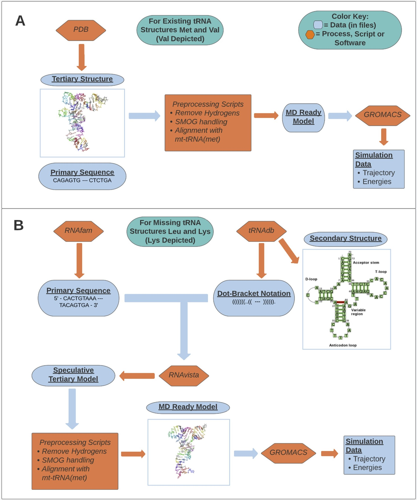

# mt-tRNA-SSS
mitochondrial-tRNA Steady State Simulator: An Application of GROMACS

### Description

[GROMACS](https://www.gromacs.org/) is a freely available software for high-performance molecular dynamics, at the atomic scale. High granularity, compatibility with the [Protein Data Bank](https://www.rcsb.org/), and availability of the structure-based architecture [SMOG 2](https://smog-server.org/smog2/) makes the simulation of RNA pretty accurate. 

My interest was piqued when looking into two mitchondrial t-RNAs (mt-tRNAs), which have known base mutations and associated diseases but no molecular understanding of the downstream effects: mt-tRNA_{Leu} and mt-tRNA_{Lys}. These don't have known (crytallized) 3D structures in the PDB, either. However, secondary structures and overall bond topology is generally known. Speculative tertiary models can be generated with these data through [RNAvista](http://rnavista.cs.put.poznan.pl/Runs/Show/502e876e-ba02-424a-8ec1-cc13235dc0dc/2a19ebd6-a2bf-43e5-98d3-1003c8fc2c13), and then cross-validated with known tertiary structures for mt-tRNA_{Met} and mt-tRNA_{Val}. These latter two structures also may serve as controls for the simulation process. 

Here's a graphical flowchart to describe the data extraction and preprocessing.

Blue subheadings represent tangible data, orange subheadings represent databases, scripts, and software used to generate or handle data. 
A: The process for the main structures, mt-tRNA_{Met} and mt-tRNA_{Val}, with crystallographic structures. Val is depicted in the visual. 
B: The process for speculative structures mt-tRNA_{Leu} and mt-tRNA_{Lys}, with Lys depicted.

## Navigation

### Notes
- Scripts to supply GROMACS are under `scripts`, as `.mdp` files.
- Tertiary PDB files for mt-tRNAs are under `data/tertiary/{mttrna}` as `.pdb` files.
- Scripts for executing and analyzing mt-tRNA data are under `scripts`, as `.ipynb` files.
- Trajectory files are under `data/tertiary/{mttrna}/{traj}` as `.xtc` files.*
- Scripts for post-run measurements in VMD are under `scripts`, as `.tcl` files.
*Note, some trajectory files aren't included again due to large file limits on Github.

### Execution

## Contact
Much of this procedure and information is distilled, as a byproduct of research I conducted throughout college. If you'd like more information, feel free to contact me @`cybercyclonedude@gmail.com`!

## References

